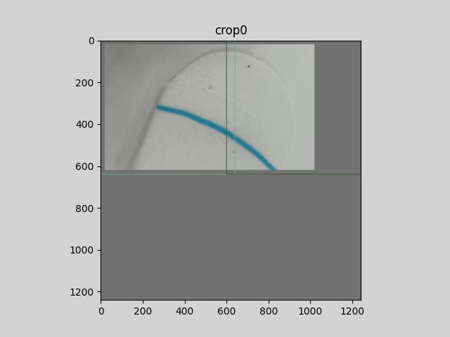
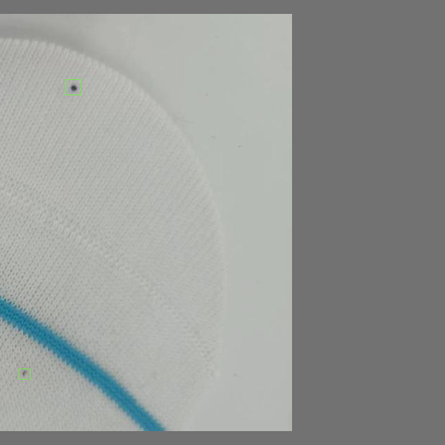

## <div align="center"> dataset split for high resolution image with bounding boxes
By jianming li  
Email: jmingl@tju.edu.cn  
This project code is a tool for high resolution image split with bounding boxes. If this tool helps for you give me a star.

### image split cell with intersections.

**note**: intersection width should bigger than the smallest defect size width.
<div align="center">
  
</div>

### image crops

<p align="left">
    
</p>

## crops with bounding boxes


<div>
    
    
</div>
<div>
    
    
</div>


```xml
<annotation><filename>&#24494;&#20449;&#22270;&#29255;_20230217153651_crop_0.jpg</filename><size><height>600</height><width>1000</width><depth>3</depth></size><object><name>hole</name><bndbox><xmin>491</xmin><ymin>181</ymin><xmax>520</xmax><ymax>220</ymax></bndbox></object></annotation>

```
```xml
<annotation>
    <filename>&#24494;&#20449;&#22270;&#29255;_20230217153651_crop_1.jpg</filename>
    <size>
        <height>600</height>
        <width>1000</width>
        <depth>3</depth>
    </size>
    <object>
        <name>dirt</name>
        <bndbox>
            <xmin>184</xmin>
            <ymin>104</ymin>
            <xmax>206</xmax>
            <ymax>126</ymax>
        </bndbox>
    </object>
</annotation>
```

```xml
<annotation>
    <filename>&#24494;&#20449;&#22270;&#29255;_20230217153651_crop_2.jpg</filename>
    <size><height>600</height><width>1000</width><depth>3</depth></size>
    <object>
        <name>hole</name>
        <bndbox>
            <xmin>491</xmin><ymin>0</ymin><xmax>520</xmax><ymax>37</ymax>
        </bndbox>
    </object>
</annotation>
```

```xml
<annotation>
    <filename>&#24494;&#20449;&#22270;&#29255;_20230217153651_crop_3.jpg</filename>
    <size><height>600</height><width>1000</width><depth>3</depth></size>
    <object>
        <name>hole</name>
        <bndbox><xmin>0</xmin><ymin>0</ymin><xmax>38</xmax><ymax>37</ymax></bndbox>
    </object>
</annotation>
```

```xml
<annotation>
    <filename>&#24494;&#20449;&#22270;&#29255;_20230217153651_crop_5.jpg</filename>
    <size><height>600</height><width>1000</width><depth>3</depth></size>
    <object>
        <name>dirt</name>
        <bndbox><xmin>117</xmin><ymin>120</ymin><xmax>133</xmax><ymax>135</ymax></bndbox>
    </object>
</annotation>
```